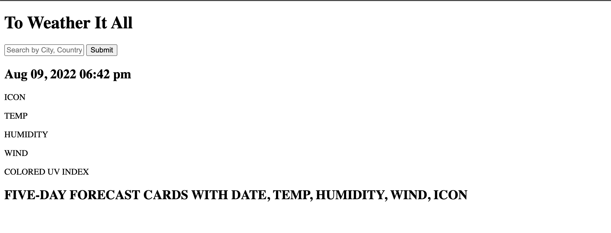

# 06 Server-Side APIs: Weather Dashboard

## Task

Third-party APIs allow developers to access their data and functionality by making requests with specific parameters to a URL. Developers are often tasked with retrieving data from another application's API and using it in the context of their own. Your challenge is to build a weather dashboard that will run in the browser and feature dynamically updated HTML and CSS.

Use the [OpenWeather One Call API](https://openweathermap.org/api/one-call-api) to retrieve weather data for cities. Read through the documentation for setup and usage instructions. You will use `localStorage` to store any persistent data. For more information on how to work with the OpenWeather API, refer to the [Full-Stack Blog on how to use API keys](https://coding-boot-camp.github.io/full-stack/apis/how-to-use-api-keys).

## User Story

```
AS A traveler
User WANTS to see the weather outlook for multiple cities
SO THAT user can plan a trip accordingly
```

## Acceptance Criteria

```
GIVEN a weather dashboard with form inputs
WHEN user searches for a city
THEN user is presented with current and future conditions for that city and that city is added to the search history
WHEN user views current weather conditions for that city
THEN user is presented with the city name, the date, an icon representation of weather conditions, the temperature, the humidity, the wind speed, and the UV index
WHEN user view the UV index
THEN user is presented with a color that indicates whether the conditions are favorable, moderate, or severe
WHEN user views future weather conditions for that city
THEN user is presented with a 5-day forecast that displays the date, an icon representation of weather conditions, the temperature, the wind speed, and the humidity
WHEN user clicks on a city in the search history
THEN user is again presented with current and future conditions for that city
```

##

The following image shows the web application's appearance and functionality:


